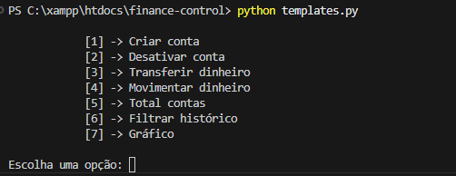

# finance-control
🪙 Sistema de Gestão de Finanças com Python Puro

<p>
  
  
  
  <a href="https://opensource.org/licenses/MIT">
    
  </a>
</p>

<br>

## Tópicos

[Sobre o Projeto](#sobre-o-projeto)

[Tecnologias](#tecnologias)

[Instalação e Uso](#instalação-e-uso)

[Licença](#licença)

<br>

## Sobre o Projeto

O Finance Control é um sistema de gerenciamento financeiro desenvolvido em Python puro com SQLModel, focado na administração de contas e transações de forma eficiente e segura. Ele permite criar e desativar contas, realizar transferências, movimentar saldo e visualizar um histórico detalhado das operações. Além disso, oferece um gráfico interativo para melhor compreensão das finanças.


<p align="center">
  
</p>


<br>

## Tecnologias

As seguintes tecnologias foram utilizadas no desenvolvimento do projeto:

- [Python](https://www.python.org/)
- [SQLModel](https://sqlmodel.tiangolo.com/) (para manipulação de dados)

<br>

## Instalação e Uso

## Pré-requisitos

Antes de começar, você precisa ter o Python 3.x instalado no seu sistema. Você pode baixar o Python [aqui](https://www.python.org/downloads/).

## Passos para Configuração e Execução

1. **Clone o repositório**:

  Abra seu terminal e clone o repositório do projeto:

  ```bash
  git clone https://github.com/yMiguelzin/finance-control.git

  ```
2. **Ative o ambiente virtual (opcional, mas recomendado)**:

  Navegue até a pasta do projeto e crie/ative um ambiente virtual:

  ```bash
  # Criar
    
  #Linux
  python3 -m venv venv
    
  #Windows
  python -m venv venv
  ```

<br>

Após a criação do venv vamos ativa-lo:

  ```bash
  #Ativar

  #Linux
  source venv/bin/activate
  
  #Windows
  venv\Scripts\Activate

  # Caso algum comando retorne um erro de permissão execute o código e tente novamente:
  Set-ExecutionPolicy -Scope CurrentUser -ExecutionPolicy RemoteSigned

  ```

3. **Instale as dependências**:

  Navegue até a pasta do projeto e instale as dependências necessárias:

  ```bash

  pip install sqlmodel

  ```

4. **Configuração do Banco de Dados**:

  Agora, configure o banco de dados:
  
  ```bash

  python models.py 

  ```
5. **Execute no terminal**:

  Inicie o comando no terminal para rodar a aplicação localmente:
  
  ```bash

  python templates.py
  
  ```

  <br>

## Licença

<a href="https://opensource.org/licenses/MIT">
    
</a>

<br>

Esse projeto está sob a licença MIT. Veja o arquivo [LICENSE](/LICENSE) para mais detalhes.

---

Feito com 💛 por [Miguel Marostica](https://github.com/yMiguelzin)
